# AWS Cloud Monitoring & Backup

Projet réalisé dans le cadre de ma formation en Génie Informatique (Systèmes, Réseaux et Cloud).

## Description

Ce projet consiste à concevoir une infrastructure Cloud sur AWS permettant de :

- Déployer deux instances EC2 Ubuntu.
- Héberger un serveur Web Apache.
- Superviser les serveurs avec Zabbix.
- Créer des alarmes avec Amazon CloudWatch.
- Gérer les accès avec IAM.
- Sauvegarder la documentation et les captures dans Amazon S3.

---

## Architecture

- VPC
- Public Subnet
- Private Subnet
- Internet Gateway
- Route Tables
- EC2 Ubuntu
- Apache Web Server
- Zabbix Server
- Amazon CloudWatch
- Amazon S3
- IAM

---

## Fonctionnalités réalisées

- Création d'une infrastructure réseau AWS.
- Déploiement de deux instances EC2.
- Installation et configuration d'Apache.
- Installation et configuration de Zabbix.
- Supervision du serveur Apache.
- Création d'une alarme CloudWatch.
- Création d'un rôle IAM.
- Création d'un Bucket Amazon S3.
- Organisation des sauvegardes et de la documentation.

---

## Outils utilisés

- Amazon AWS
- Amazon EC2
- Amazon VPC
- Amazon S3
- Amazon CloudWatch
- IAM
- Ubuntu Server
- Apache2
- Zabbix 7
- Linux

---

# Captures d'écran

### Création du VPC

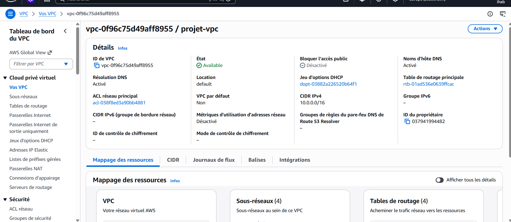

### Création des Subnets

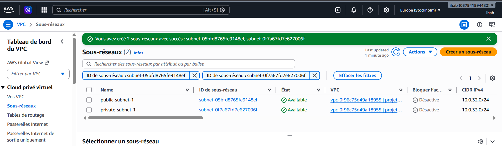

### Configuration des Tables de routage

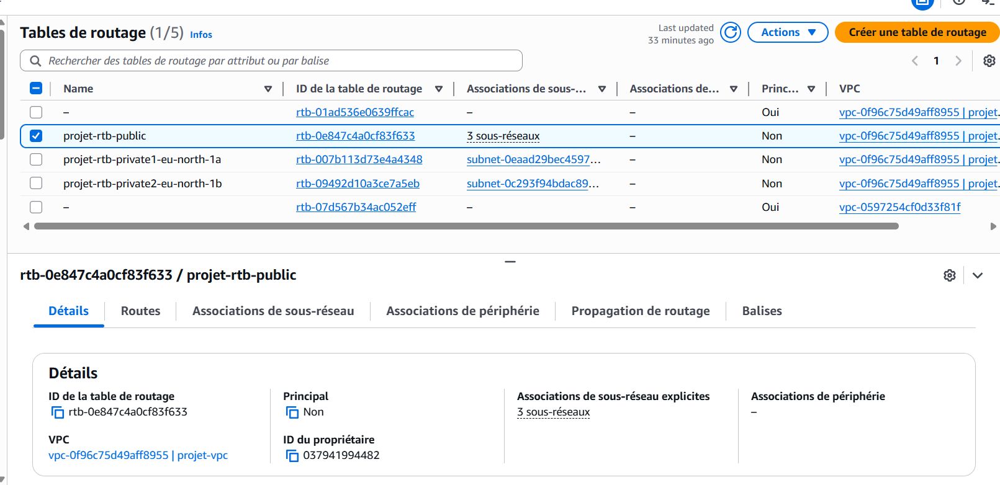

### Déploiement des instances EC2

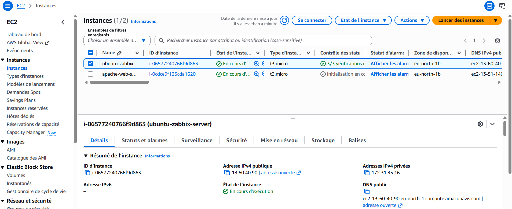

### Vérification du serveur Apache

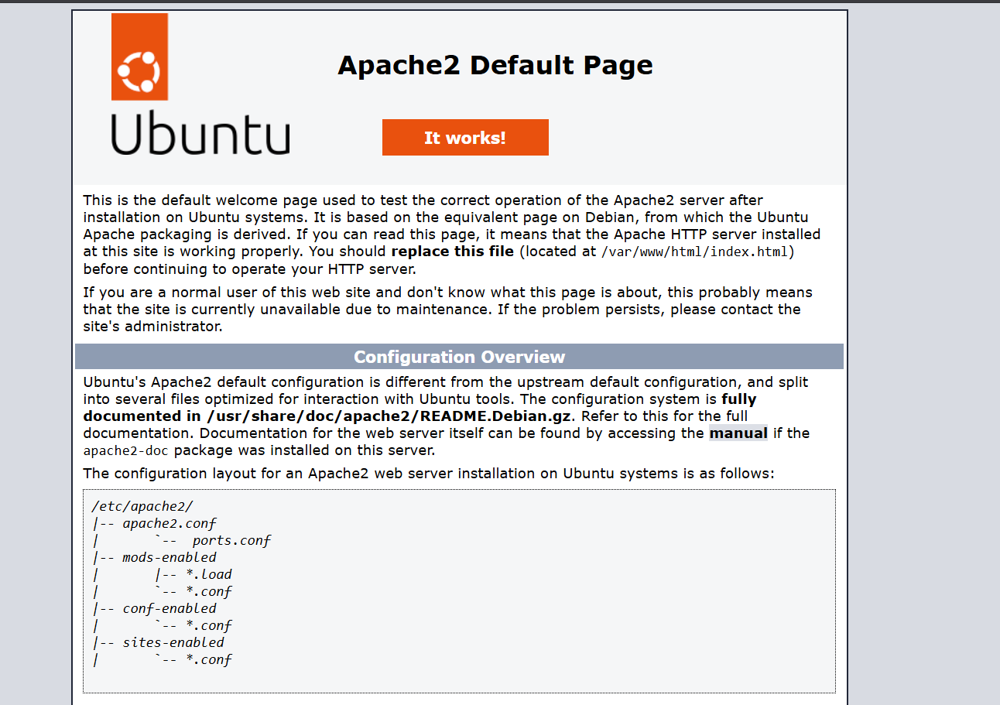

### Dashboard Zabbix

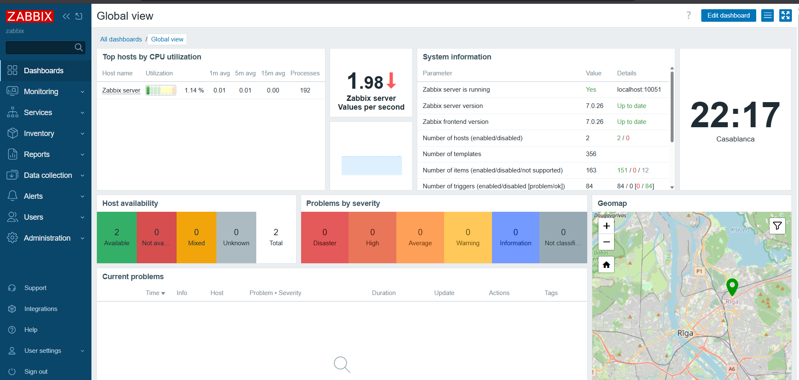

### Configuration de l'hôte Apache dans Zabbix

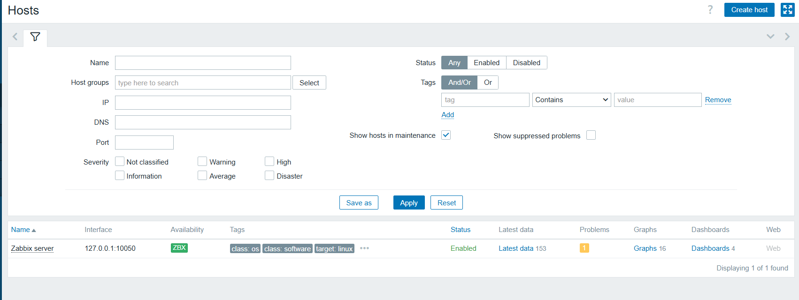

### Supervision du serveur Apache

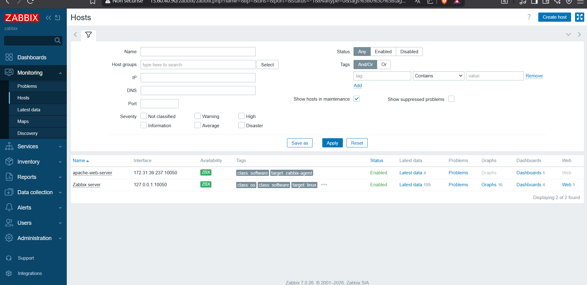

### Alarme Amazon CloudWatch

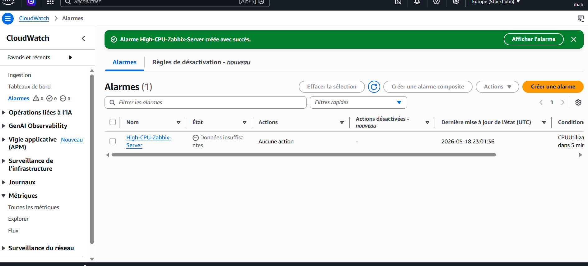

### Configuration du rôle IAM

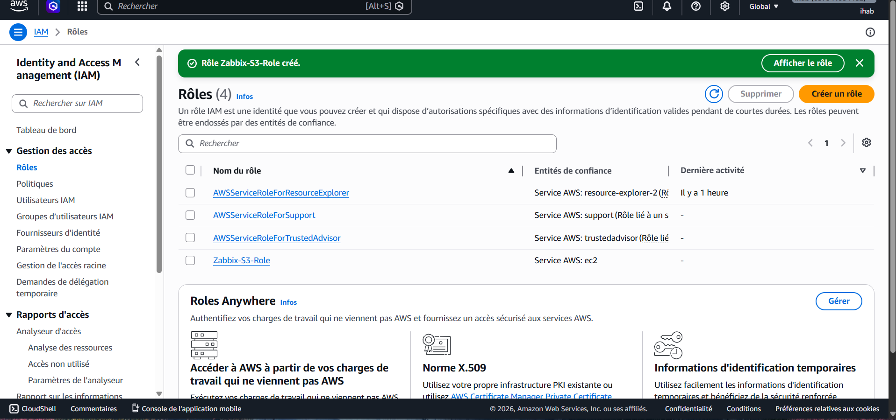

### Création du Bucket Amazon S3

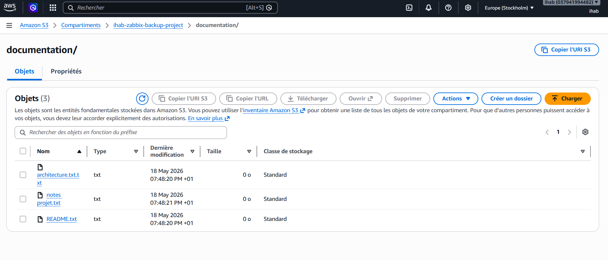
---

## Auteur

**Ihab Hadef**

Étudiant en Génie Informatique  
Spécialité : Systèmes, Réseaux et Cloud
